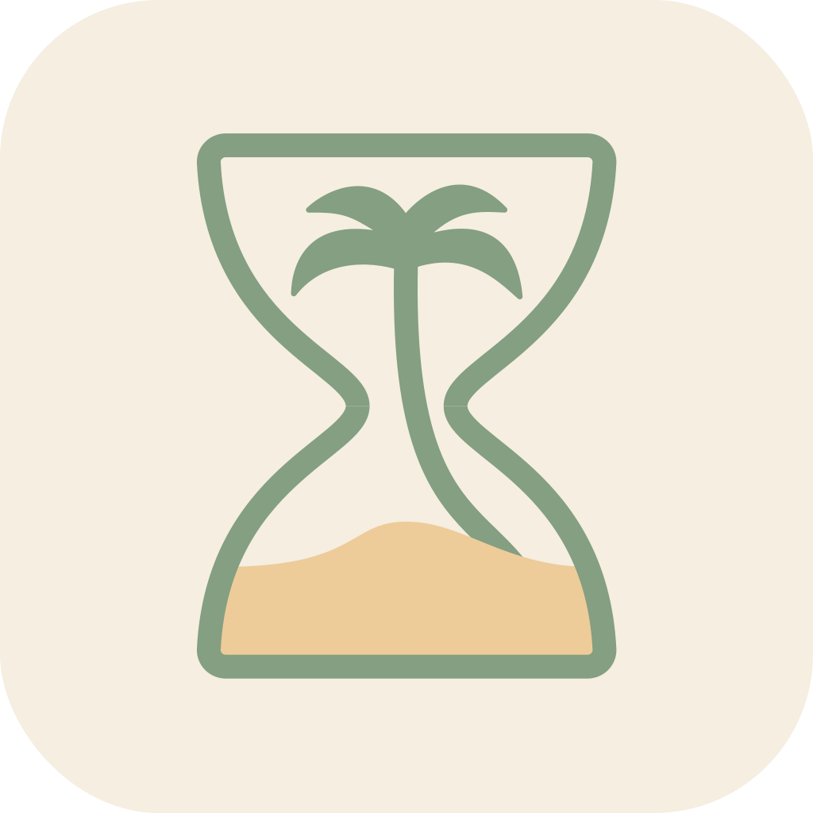

### `Zen Pomo` 🌴

**Zen Pomo** is a minimalist, distraction-free Pomodoro timer extension designed to help you stay focused, productive, and calm—one session at a time.

No notifications. No clutter. Just mindful productivity.

## 🧑‍💻 Authors

- Dylan Tran
- Austin Phan

## License

This project is licensed under the MIT License. See the [LICENSE](LICENSE) file for details.

---

Feel free to ⭐ the repo if you find this useful! Contributions and suggestions are welcome.
